# CSU 校卡余额自动读取配置

中南大学电费统计，改编自华东理工的[电费余额查询项目](https://github.com/lxl66566/ecust-electricity-statistics)，配置方法如下。

在操作下面步骤之前，请先注册 Github 账号。

## 自动读取配置

1. 获取 PUSHPLUS Token

登录[pushplus 官网](https://www.pushplus.plus/)，用微信扫码登录后，进入导航栏 - 发送消息 - 一对一消息，如下图所示复制 PUSHPLUS Token，存好备用。

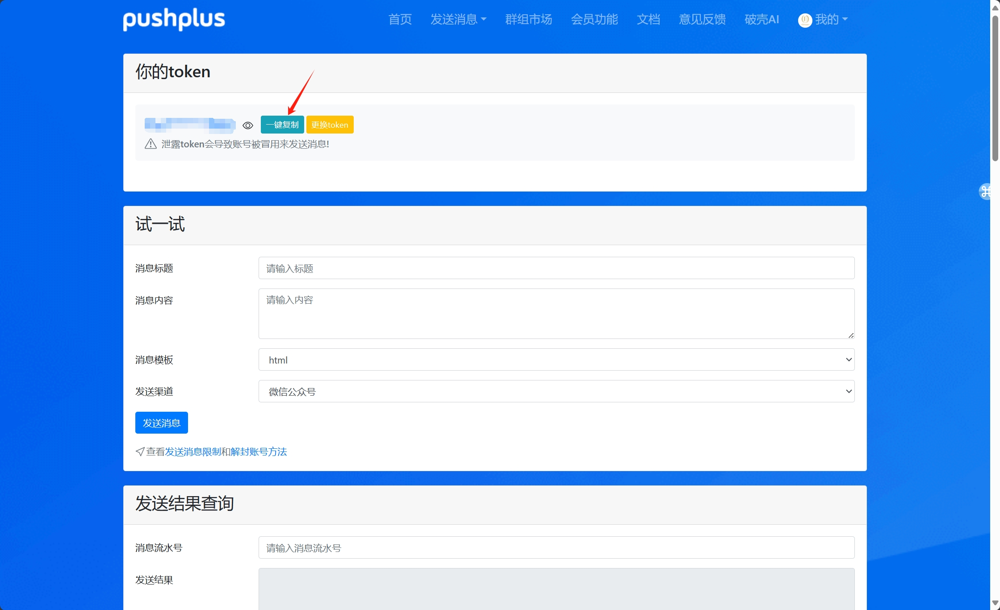

2. fork [本仓库](https://github.com/dream-oyh/CSU_card_read)

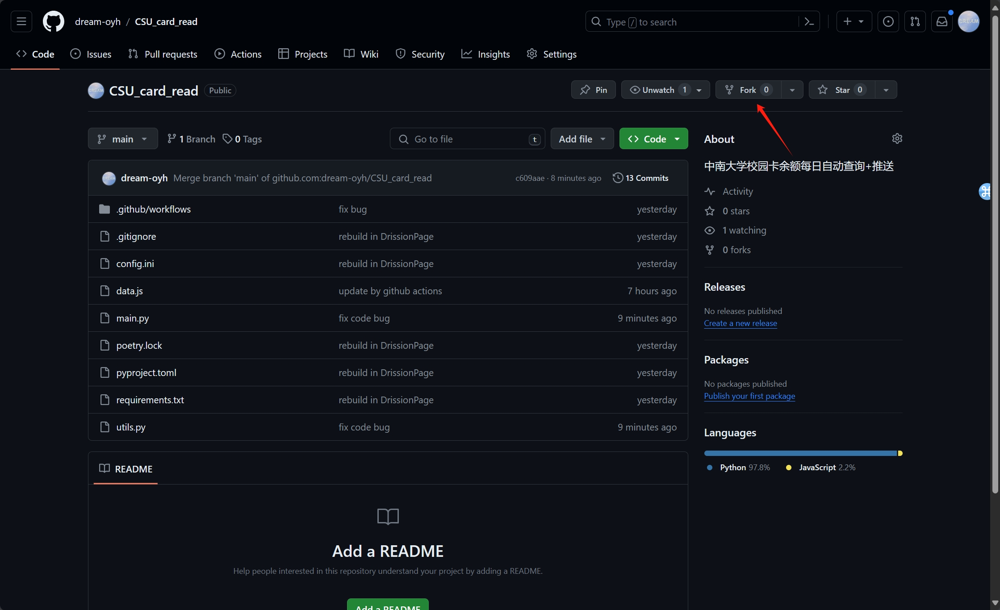

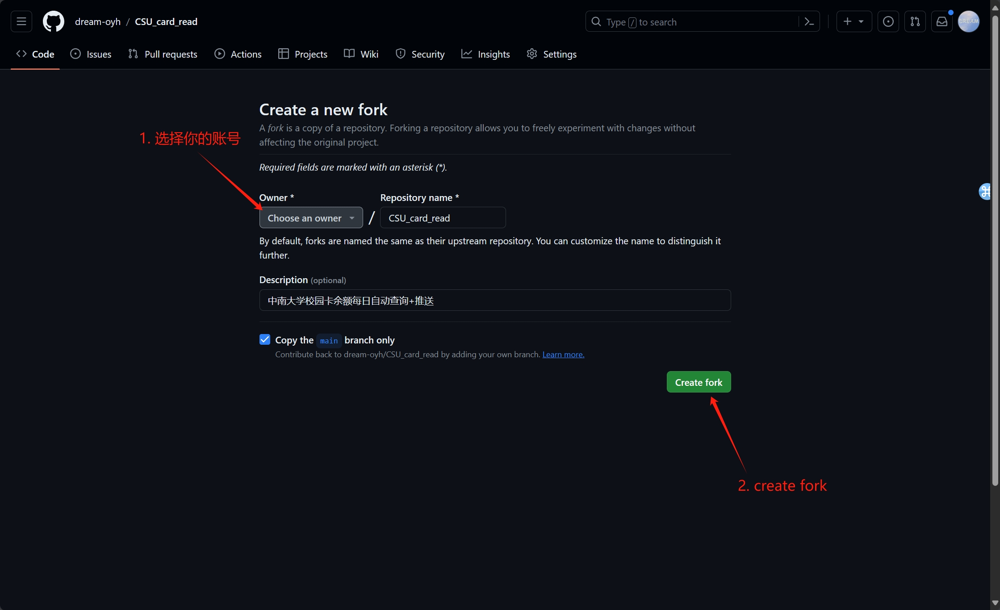

3. 创建环境变量，从侧边栏`Secrets and variables`-`Actions`-`New Repository secret`

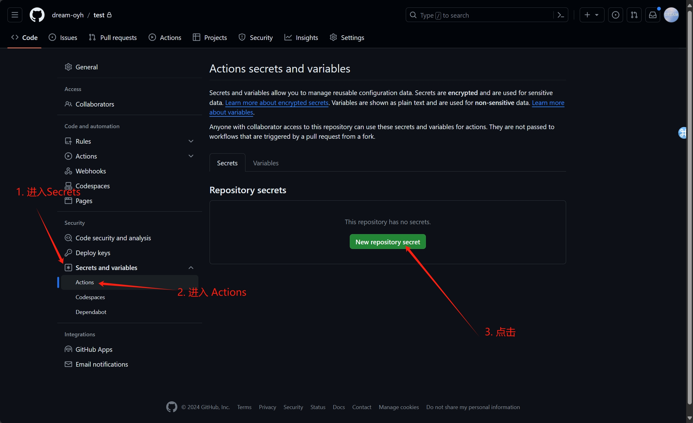

4. 填写变量名

| 变量名（Name）  |        密码（Secret）         |
| :-------------: | :---------------------------: |
|      COUNT      |             学号              |
|       PWD       |         身份证后六位          |
| PUSH_PLUS_TOKEN | 输入前面保存的 pushplus token |

> 注意变量名不能写错，否则无法正常运行

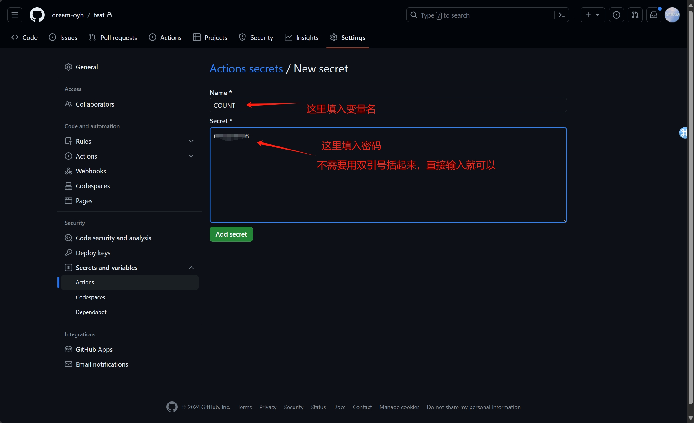

5. 开启 Actions，从导航栏进入`Actions`，点击绿色按钮

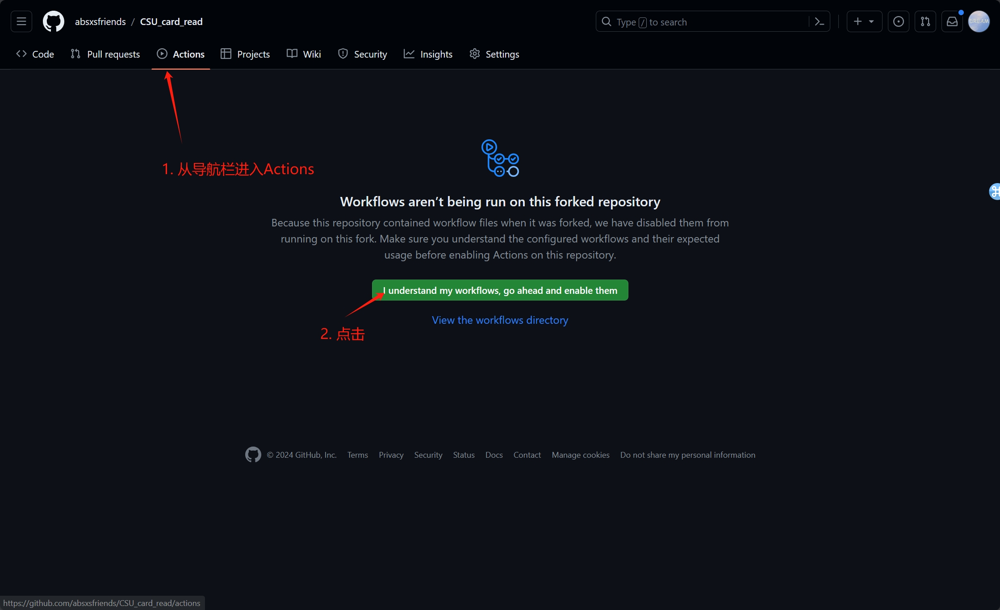

6. 开启`Workflows`

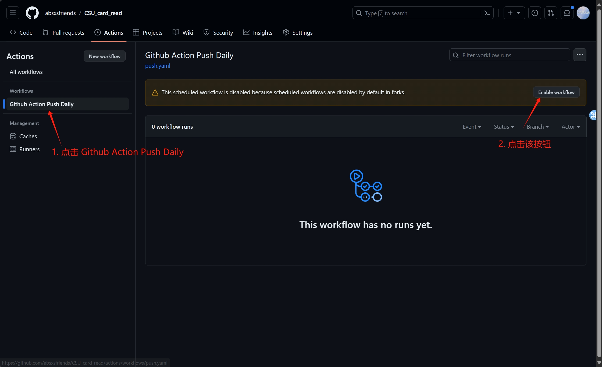

7. 回到 code，删除 `data.js`文件

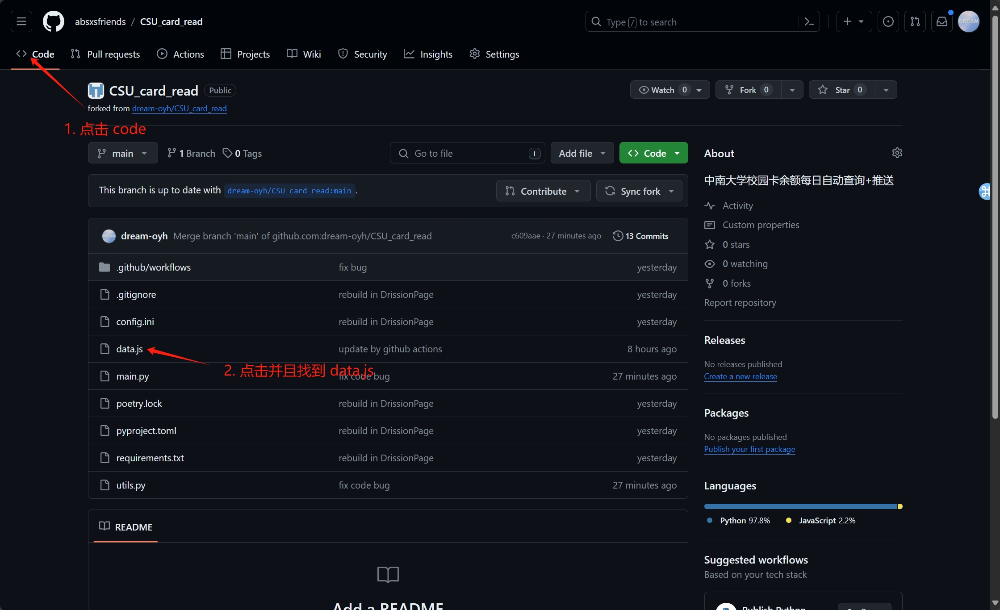

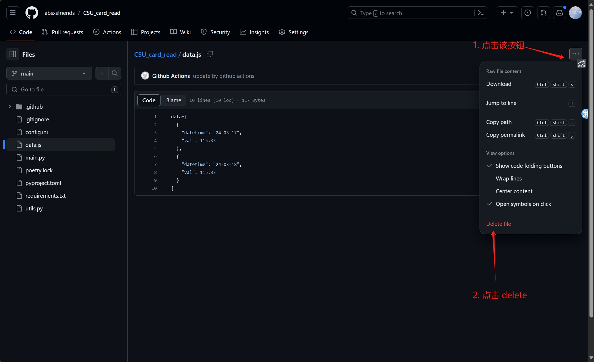

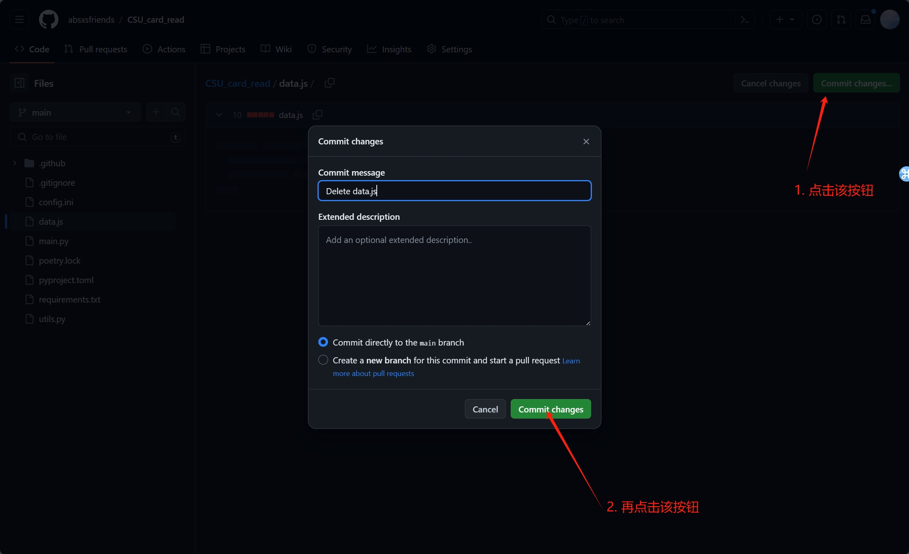

## 自定义配置

打开 `config.ini`文件，依照提示修改信息，之后 `commit changes`即可。

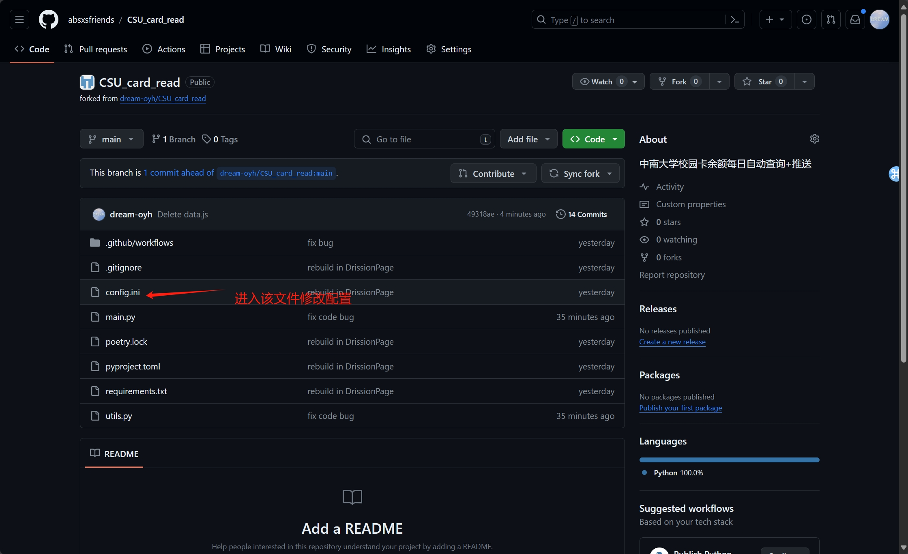

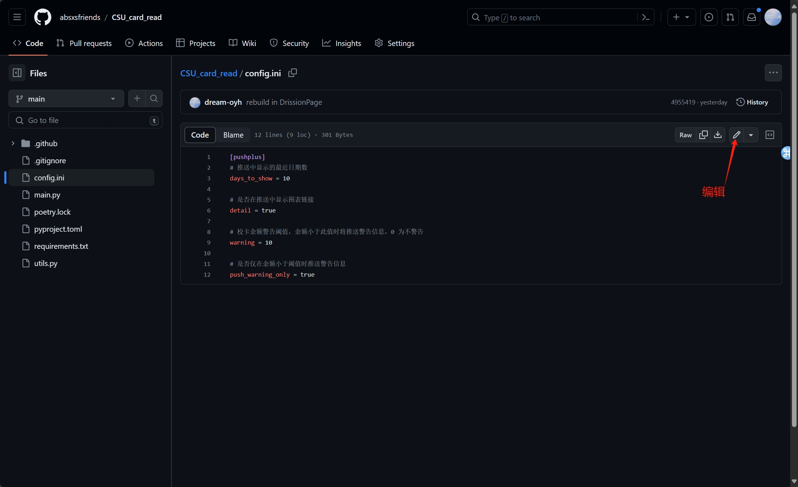
